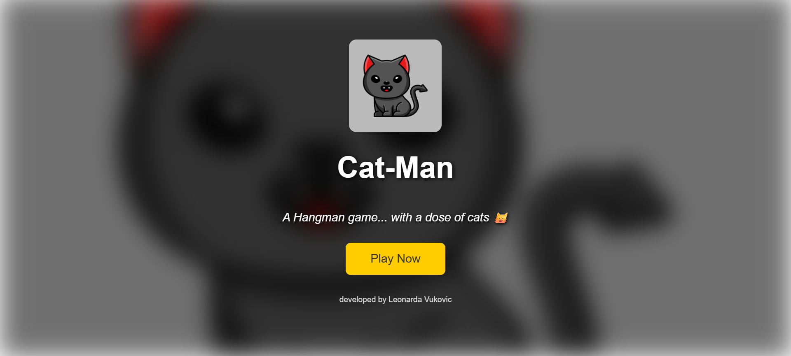
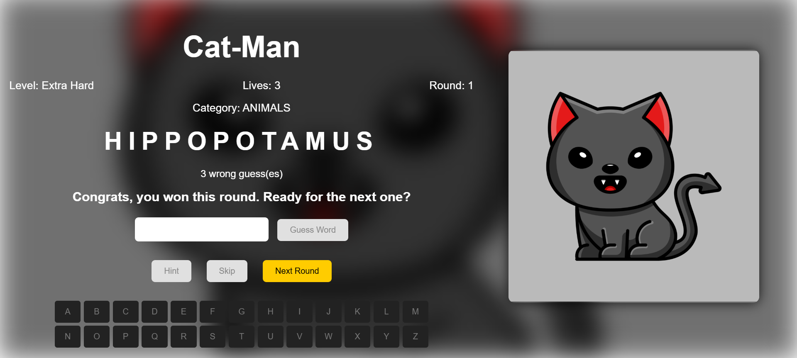
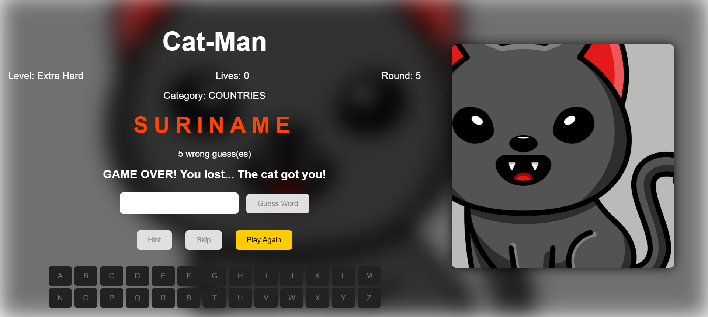

# Cat-Man

Cat-Man is a game inspired by Hangman. It's built with HTML, CSS, JavaScript, and jQuery. Players progress through multiple difficulty levels while trying to survive an increasingly determined cat by correctly guessing hidden words and phrases.

This project was originally developed as part of a web development course. After submission, the codebase was cleaned up and improved before being published on GitHub.

---

## Features

- Four progressively challenging difficulty levels
- Forty rounds of gameplay across the entire game
- Categories including Food, Countries, and Animals
- Letter-by-letter and full-word guessing
- Limited hints and skip functionality
- Lives that carry over between difficulty levels
- Random word selection without repetition during a game session
- Automatic loading of the word database from a CSV file

---

## Technologies

- HTML5
- CSS3
- JavaScript
- jQuery

---

## Screenshots

### Home Screen



### Gameplay



### Game Over



---

## Play the Game

1. Clone the repository

```bash
git clone https://github.com/leonarda-vukovic/cat-man-game.git
```

2. Open the project in Visual Studio Code.

3. Run the project using the Live Server extension.

---

## Gameplay

Choose one of four difficulty levels and complete ten rounds per level.

Each incorrect guess brings the cat closer while reducing the number of guesses available for the current round. Losing a round costs one life, but progression continues until all lives are lost.

Players may guess individual letters or attempt the entire word at once. Three hints and one skip are available throughout the game.

The objective is to survive every round and escape the cat.

---


## Credits

The cat illustration is sourced from Vecteezy and is credited within the project.

All game logic, interface design, gameplay mechanics, story, and implementation were developed by me.

---

## License

This project is licensed under the MIT License — see the [LICENSE](LICENSE) file for details.
